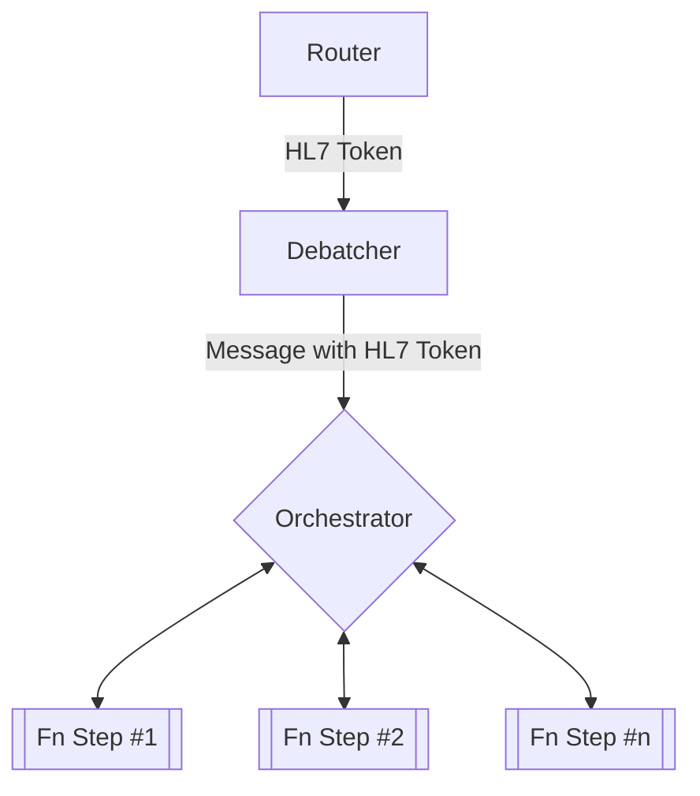

# HL7 Pipeline with Orchestration

This build contains a POC of the HL7 pipeline with a dedicated router and orchestrator functionality. 

## Description
To support a modular pipeline, the pipeline needs to determine the "steps" to complete a particular type of message dynamically. 

For example, Message 1 may need steps A, B, D while another may need B, C, D.

To support this, a router would need to retrieve the step sequence for a given message and pass on the information forward. The attached information will be referenced as an **HL7 Token**.

The attributes of the **HL7 Token** haven't been finalized, but the token itself must answer the following questions:

- Where do I retrieve the message from?
- What is the message type?
- What steps are required to process a given message?

It is also worth noting that function level configurations could also be attached at the token level or simply retrieved at the function level. For example, if the JSON-Lake function requires certain configurations to handle a CASE message, then the token itself can "carry" those configurations or have the JSON-Lake function handle the configuration retrieval itself. 
  
## Build

This repository has 4 distinct differences when compared to the existing HL7 build. 

1. All functions exist within the same Function App Resource
	1.a This can be demonstrated in the single pom.xml file but this is ultimately to support durable orchestration.
2. A new **Router** Azure Function
	2.a ServiceBus triggered
	2.b Retrieves pertinent HL7 Token
	2.c Sends Token to Debatcher
3. A new **Orchestration** Azure Function
	3.a Durable Function that will call the function steps dictated in the HL7 Token
	3.b With the Orchestrator containing a Durable Orchestrator, all functions that are called are "Durable Activities"
4. Debatcher
	4.a Unique messages are saved in a storage location (tbd) at each step of the process.
	4.b Messages are not passed directly from function to function 
	
Durable Function References: 
- [Manage instances in Durable Functions - Azure | Microsoft Learn](https://learn.microsoft.com/en-us/azure/azure-functions/durable/durable-functions-instance-management?tabs=csharp)
- [Durable Orchestrations - Azure Functions | Microsoft Learn](https://learn.microsoft.com/en-us/azure/azure-functions/durable/durable-functions-orchestrations?tabs=csharp-inproc)

## Diagram

Note, at the time of the POC, the Debatcher function is saving debatched messages into a storage location where the step functions would then retrieve and then save a new version once that step was completed. This is distinctly different to the current pipeline where the complete message is passed forward.

### Contact

If there are any additional questions, please reach out to Sebastian Clavijo (uux3@cdc.gov) or Jesus Aguilar (csb0@cdc.gov)
